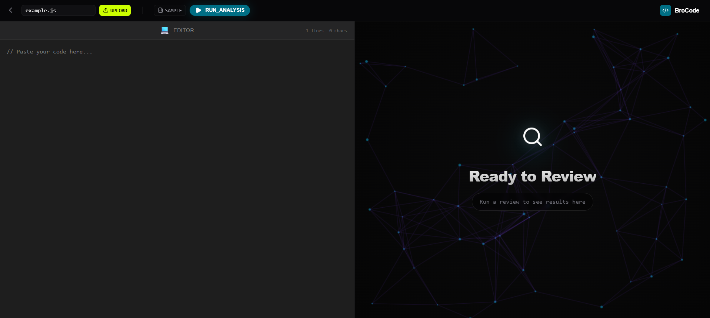
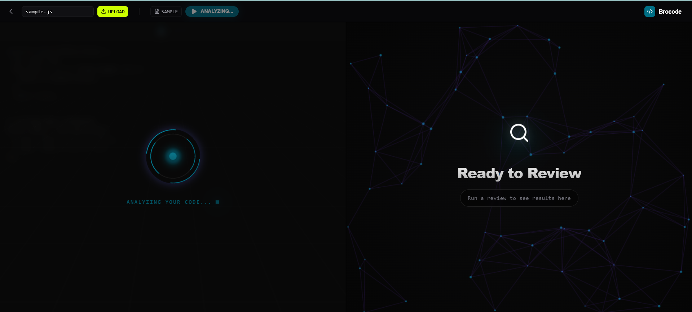
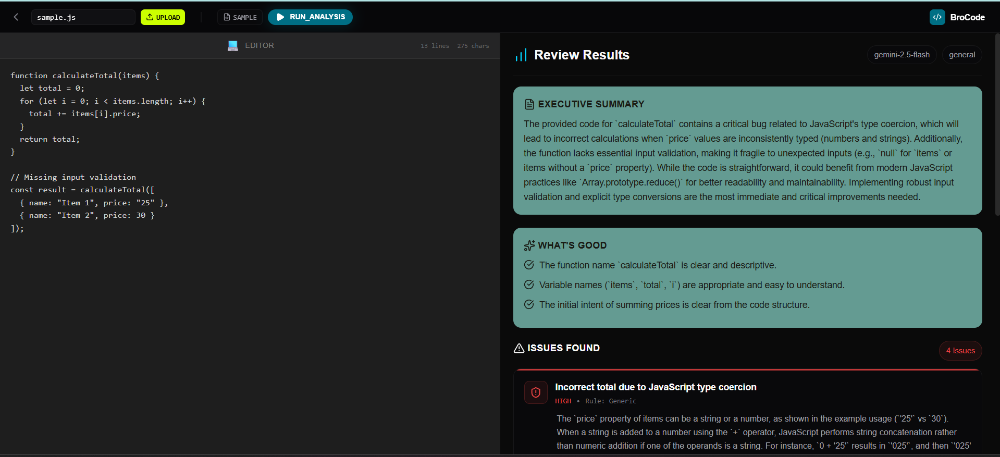

# BroCode 

AI-powered code review bot that automatically reviews your Pull Requests.

[BroCode Review](docs/brocode_review.pdf)

## What it does

Open a PR → BroCode reviews it → Get feedback in seconds.

No setup needed for reviewers. No waiting for teammates. Just push your code and get instant AI feedback on:
- Bugs and potential issues
- Code style improvements  
- Best practices
- Security concerns

## Demo

Landing page


While Review


After Review


## How it works

```
You open a PR
     ↓
GitHub sends webhook to BroCode
     ↓
BroCode fetches the diff
     ↓
Gemini AI analyzes the code
     ↓
Review posted as PR comment
```

## Tech Stack

**Backend**
- FastAPI
- Google Gemini API
- GitHub Webhooks

**Frontend** 
- React + Vite
- Tailwind CSS
- shadcn/ui

## Setup

### Prerequisites
- Conda
- Node.js 18+
- ngrok (for local development)
- GitHub account
- Google AI API key

### Backend

```bash
cd backend

# Create conda environment
conda create -n brocode python=3.11
conda activate brocode

# Install dependencies
pip install -r requirements.txt

# Create .env file
cp .env.example .env
# Add your keys:
# GEMINI_API_KEY=your_key
# GITHUB_TOKEN=your_token
# GITHUB_WEBHOOK_SECRET=your_secret

# Run
uvicorn app.main:app --reload --port 8000
```

### Frontend

```bash
cd frontend
npm install
npm run dev
```

### Webhook Setup

1. Start ngrok: `ngrok http 8000`
2. Go to your GitHub repo → Settings → Webhooks
3. Add webhook:
   - URL: `https://your-ngrok-url/api/webhooks/github`
   - Content type: `application/json`
   - Secret: same as `GITHUB_WEBHOOK_SECRET`
   - Events: Pull requests, Pushes

## Project Structure

```
brocode/
├── backend/
│   ├── app/
│   │   ├── api/routes/
│   │   │   ├── review.py
│   │   │   └── webhooks.py
│   │   ├── core/
│   │   │   └── gemini_client.py
│   │   └── services/
│   │       ├── github_service.py
│   │       └── pr_review_service.py
│   └── requirements.txt
│
└── frontend/
    ├── src/
    │   ├── components/
    │   │   ├── ui/
    │   │   ├── layout/
    │   │   └── features/
    │   ├── hooks/
    │   ├── services/
    │   └── config/
    └── package.json
```

## Environment Variables

```env
# Backend
GEMINI_API_KEY=         # Google AI Studio
GITHUB_TOKEN=           # GitHub PAT with repo scope
GITHUB_WEBHOOK_SECRET=  # Random string for webhook verification
```

## API Endpoints

| Method | Endpoint | Description |
|--------|----------|-------------|
| POST | `/api/review/analyze` | Analyze code snippet |
| POST | `/api/webhooks/github` | GitHub webhook receiver |
| GET | `/api/health` | Health check |

## Features

- [x] GitHub webhook integration
- [x] Automatic PR reviews
- [x] Gemini AI integration
- [x] Web UI for manual code review
- [ ] Support for multiple AI providers
- [ ] Line-by-line comments on PRs
- [ ] Review history dashboard

## License

MIT